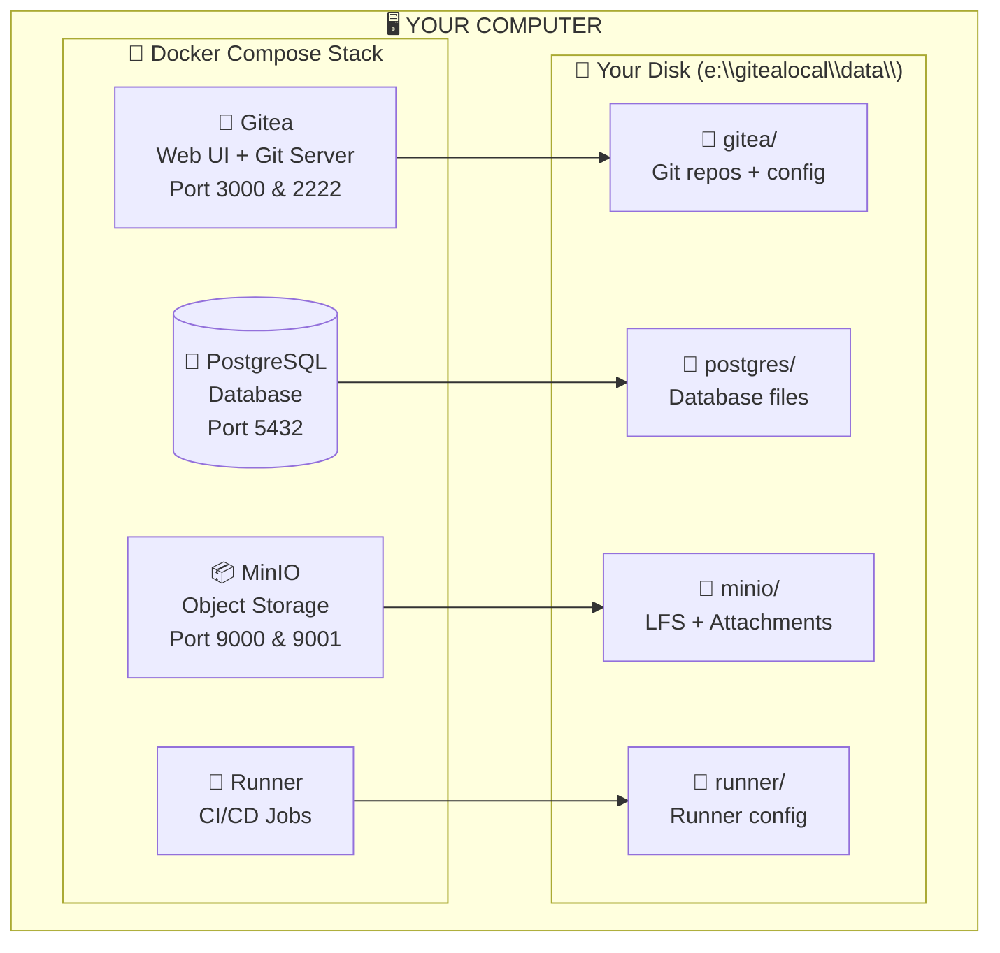
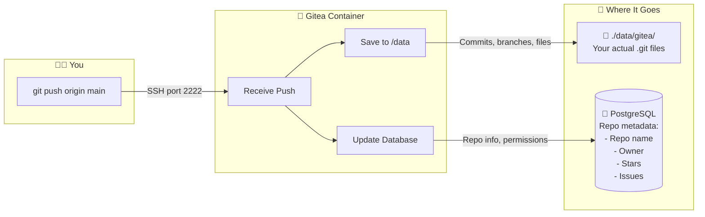
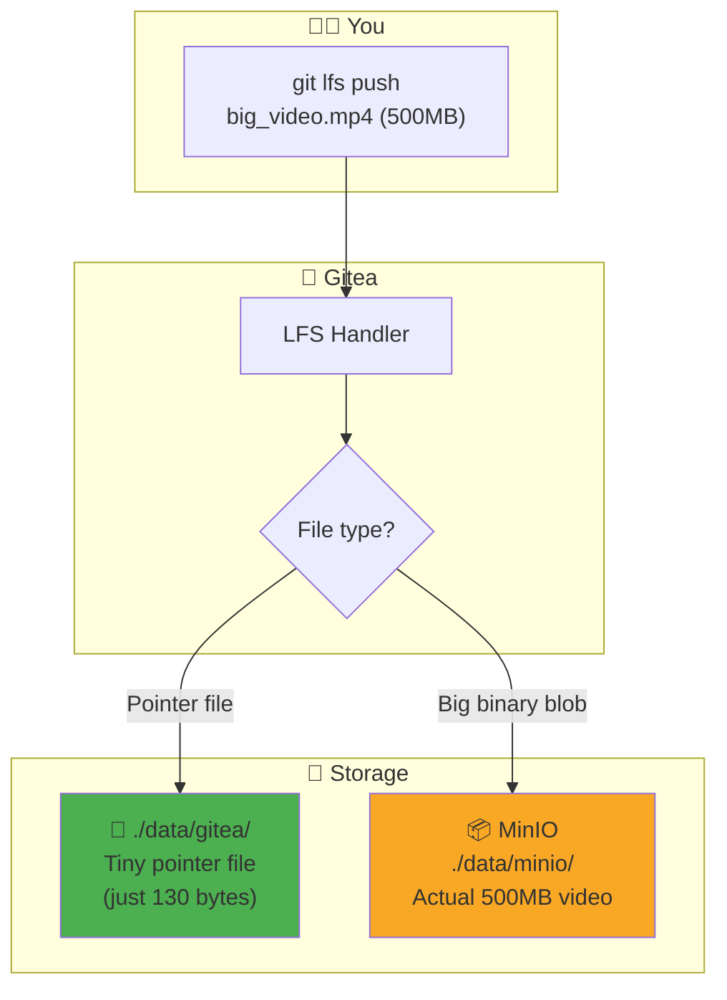
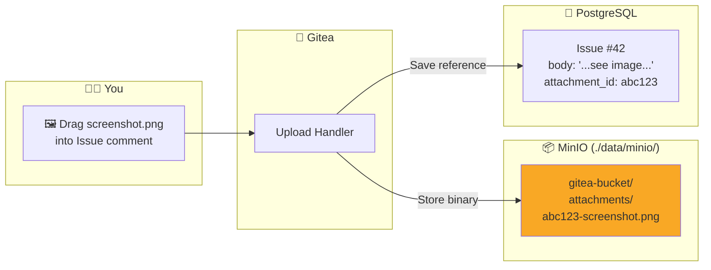
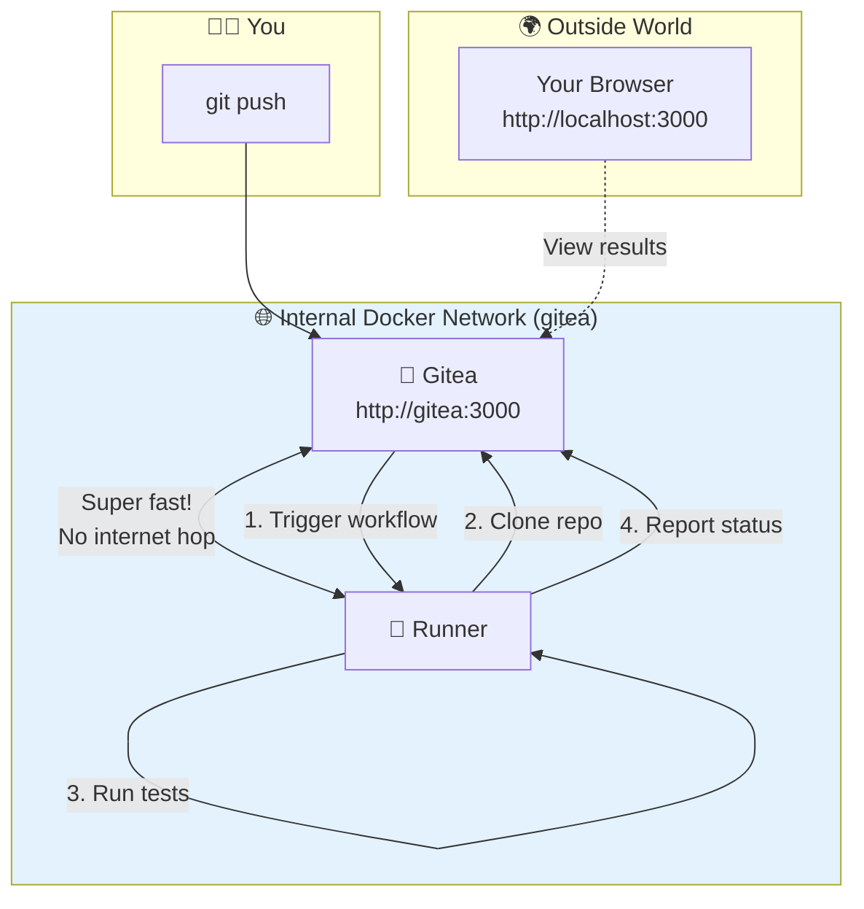
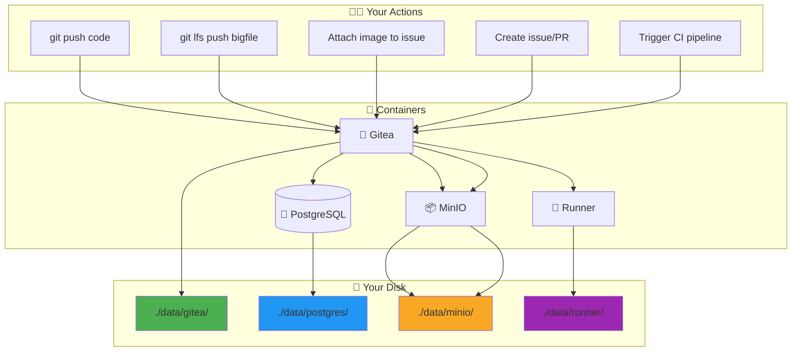

# 🧠 Gitea + PostgreSQL + MinIO Architecture - Visual Guide

## 🏗️ The Big Picture - What Lives Where?



---

## 🎬 Scenario 1: You Push Code to Gitea

**Imagine:** You run `git push origin main` to upload your project



### 📍 Where does your code actually go?

| What | Where | Example |
|------|-------|---------|
| Your actual code files | `./data/gitea/git/repositories/` | `./data/gitea/git/repositories/yourname/project.git/` |
| Repo metadata (name, stars, issues) | PostgreSQL | Stored in database tables |

---

## 🎬 Scenario 2: You Upload a Large File (LFS)

**Imagine:** You're storing a 500MB video file with Git LFS



### 🤔 Why use MinIO for LFS?

| Without MinIO | With MinIO |
|---------------|------------|
| 500MB video stored in git folder | 500MB video in MinIO bucket |
| Git operations become SLOW 🐌 | Git stays FAST 🚀 |
| Backup is complicated | Easy to backup separately |

---

## 🎬 Scenario 3: You Attach an Image to an Issue

**Imagine:** You drag & drop a screenshot into a GitHub Issue



---

## 🎬 Scenario 4: CI/CD Pipeline Runs

**Imagine:** You push code and it triggers a build



### ⚡ Why is the Runner on the same network?

```
┌─────────────────────────────────────────────────────────────┐
│  WITHOUT same network:                                       │
│                                                              │
│  Runner ──→ Internet ──→ localhost:3000 ──→ Gitea           │
│         🐌 SLOW (100ms+ latency)                            │
└─────────────────────────────────────────────────────────────┘

┌─────────────────────────────────────────────────────────────┐
│  WITH same network (your setup):                             │
│                                                              │
│  Runner ──→ gitea:3000 ──→ Gitea                            │
│         ⚡ INSTANT (<1ms latency)                            │
└─────────────────────────────────────────────────────────────┘
```

---

## 🗄️ Complete Data Flow Summary



---

## 📊 What Stores What - Simple Table

| Container | What It Stores | Disk Location | Example Data |
|-----------|---------------|---------------|--------------|
| 🦊 **Gitea** | Git repositories, config | `./data/gitea/` | Your actual code, branches, commits |
| 🐘 **PostgreSQL** | Metadata & relationships | `./data/postgres/` | Users, repos, issues, PRs, comments, permissions |
| 📦 **MinIO** | Large binary files | `./data/minio/` | LFS files, issue attachments, avatars |
| 🏃 **Runner** | CI/CD config & cache | `./data/runner/` | Runner registration, job cache |

---

## 🎯 Real-World Analogy

Think of it like a **Library** 📚:

```
┌────────────────────────────────────────────────────────────────┐
│  🏛️ LIBRARY (Gitea)                                           │
│                                                                │
│  📚 Bookshelves = ./data/gitea/                                │
│     (Your actual books/code)                                   │
│                                                                │
│  🗃️ Card Catalog = PostgreSQL                                  │
│     (Where is each book? Who borrowed it? Reviews?)            │
│                                                                │
│  📦 Storage Warehouse = MinIO                                  │
│     (Giant maps, posters, videos - too big for shelves)        │
│                                                                │
│  🏃 Delivery Truck = Runner                                    │
│     (Picks up code, runs tests, delivers results)              │
└────────────────────────────────────────────────────────────────┘
```

---

## ❓ Quick FAQ

**Q: If I delete the database, do I lose my code?**  
A: NO! Your code is in `./data/gitea/`. But you'll lose issues, PRs, users, permissions.

**Q: If I delete MinIO, do I lose my code?**  
A: NO! Your code is in `./data/gitea/`. But you'll lose LFS files and attachments.

**Q: Can I backup just the code?**  
A: YES! Just backup `./data/gitea/git/repositories/`

**Q: Why not store everything in one place?**  
A: Performance! Each tool is optimized for its job:
- Git = fast code versioning
- PostgreSQL = fast queries on structured data
- MinIO = efficient large file storage
