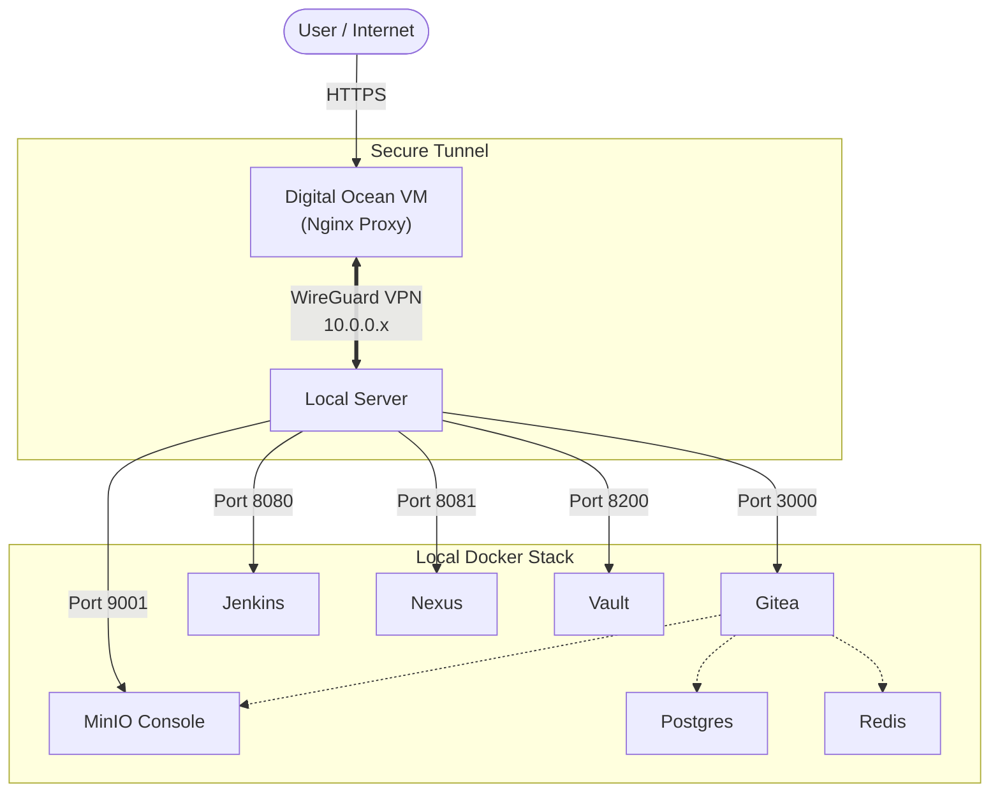

# 🚀 Local DevOps Stack

A comprehensive, self-hosted DevOps stack running locally with Docker Compose. Designed to be accessed securely via WireGuard from a remote proxy.

## 🏗️ Architecture

This stack is designed to run on a local machine (e.g., a home server) while being accessible publicly or privately via a secure WireGuard tunnel.



## 📦 Services

| Service | Local Port | Description |
|---------|------------|-------------|
| **Gitea** | `3000` | SCM, Git hosting |
| **Gitea SSH** | `2222` | SSH Passthrough for Git |
| **MinIO** | `9000` (API)<br/>`9001` (UI) | S3-compatible object storage |
| **Jenkins** | `8080` | CI/CD Automation |
| **Nexus** | `8081` | Artifact Registry (Maven, Docker, etc.) |
| **Vault** | `8200` | Secrets Management |

## 🛠️ Prerequisites

- **Docker Desktop** or Docker Engine + Compose
- **WireGuard**: Configured if remote access is required.

## 🚀 Setup Guide

1.  **Clone the repository**:
    ```bash
    git clone https://github.com/your-username/local-devops-stack.git
    cd local-devops-stack
    ```

2.  **Configure Environment**:
    copy the example file and update your secrets.
    ```bash
    cp .env.example .env
    ```
    > **Note**: Update `GITEA_DOMAIN`, `POSTGRES_PASSWORD`, etc., in `.env`.

3.  **Start the Stack**:
    ```bash
    docker-compose up -d
    ```

4.  **Access Services**:
    Open your browser to `http://localhost:3000` to set up Gitea.

## 📂 Data Storage

All data is persisted locally in the `./data` directory (ignored by git):
- `./data/gitea`: Repositories and user data
- `./data/postgres`: Database files
- `./data/minio`: S3 Objects (LFS, Packages)

## 🔒 Security

- **No Local SSL**: This stack exposes **HTTP** ports. SSL termination should be handled by your reverse proxy (e.g., Nginx on your VPS).
- **Secrets**: Provide secrets via the `.env` file. Do not commit `.env` to version control.
